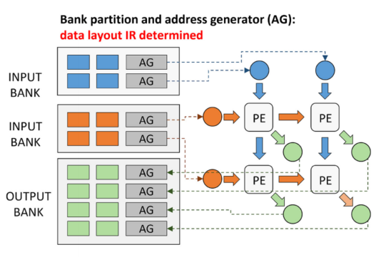
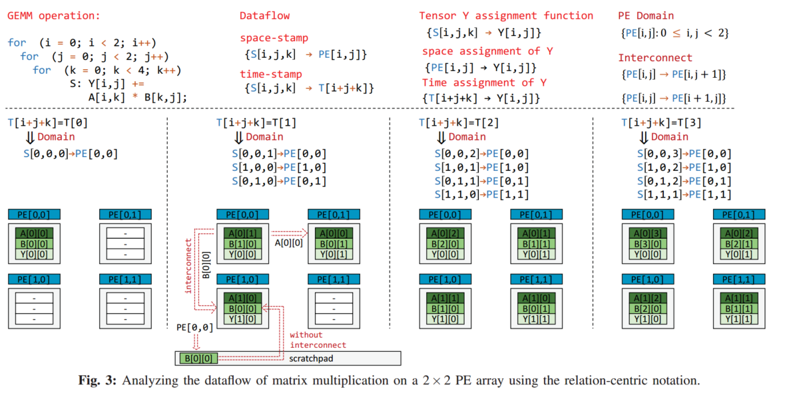
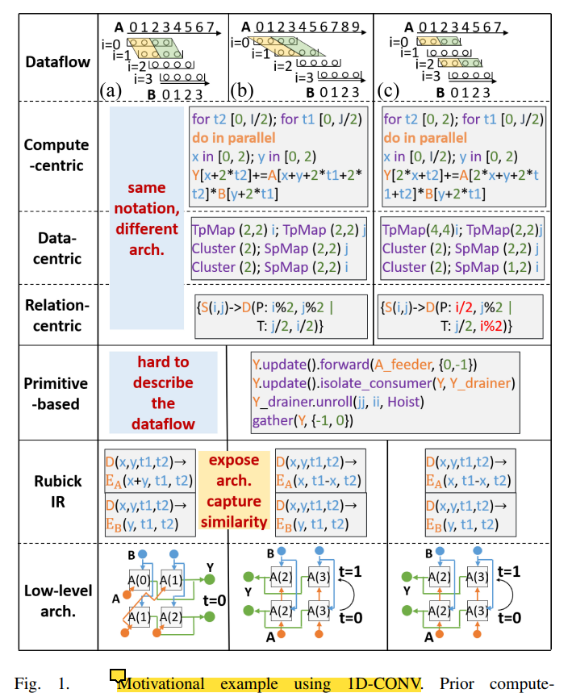
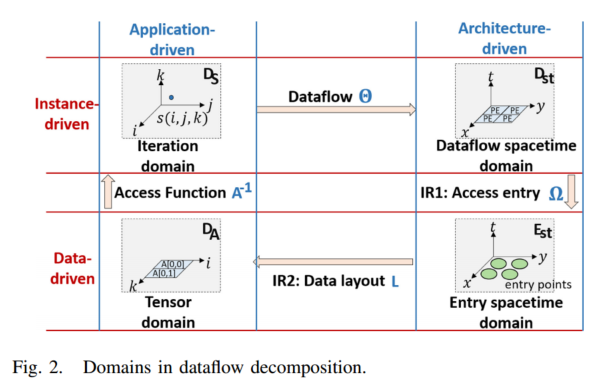
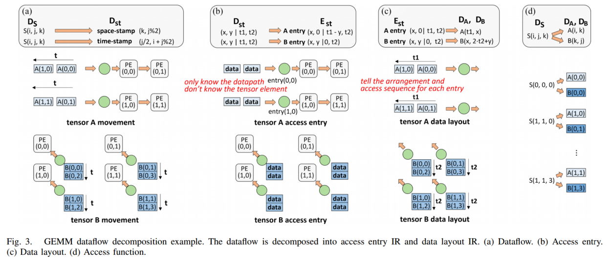
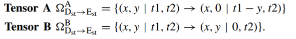
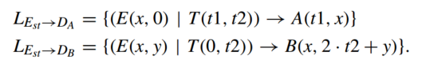
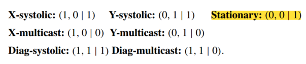
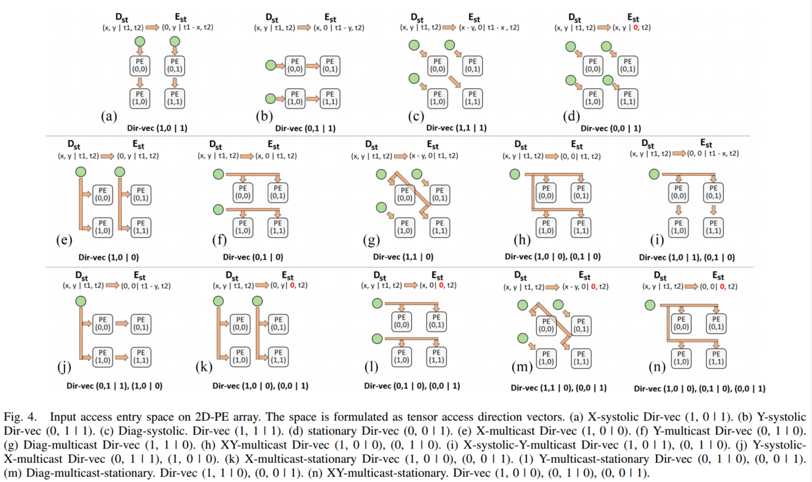
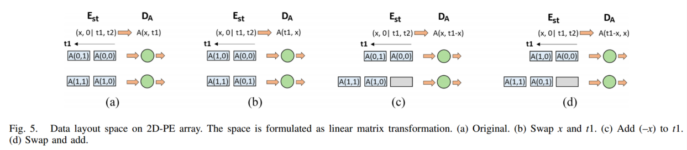

# Rubick

* 作者：卢丽强，罗子璋，梁云*
* 单位：北京大学，浙江大学
* DAC’23，TCAD‘24

# Abstract 

之前的工作集中于张量元素的复用，而没有去探索底层架构的实现。通过将数据流分解为两种低层级IR来暴露架构实现：

* access entry：是一个时空戳，空间戳表示具体的入口，即memory port，时间戳表示相应时间的端口
* data layout：常规意义的data layout，结合access entry可以表示memory bank

结果上，Rubick通过优化access entry IR减少了82.4%的布线资源，仅增加2.7%的延迟(使用脉动阵列的形式），通过优化data layout IR减少了70.8%的内存开销，并且通过在两种IR各自的子空间中剪枝，将DSE时间加速了$1.1\times 10^5$。

# 1 Introduction

动机

* 首先之前的工作男子表示处数据的访问模式和data layout(如之前的工作很多都忽略脉动阵列和广播的差别)。
* 杂糅的高层设计空间参数带来很大的设计空间
* 不同架构的结构相似性难以在高层级识别

贡献

* 将数据流分解为两种IR，从而更具体的暴露出memory和计算。
* 分别将生成两种IR(减少数据的相似性)然后组合在一起。
* 给出的IR和实现细节之间的关系，并开发了一个Chisel模板来使用IR进行硬件生成

​​

# 2 Backround

## 2.A 张量基础

‍

> * 迭代域(Iteration Domain)
>
>   * 一个具有一个语句S的嵌套循环，其迭代域$D_S$是包含所有循环实例的集合，每个循环实例可以表示为$S[\vec{n}]$，是$D_S$中的一个点。
>   * 如对于一个一维卷积，其迭代域记为$D_S=\{S[i,j]:0\leq i<4,0\leq j<3\}$

‍

* 张量域：表示为张量中的所有元素，使用$\vec{n'}$表示向量元素

$$
D_A=\left\{A(\vec{n'})\right\}
$$

> * 访问函数(Access Function)
>
>   * 给定一个循环实例，访问函数返回语句S访问的张量元素。使用一个关系(映射)来表张量$F$的访问函数。
>   * $$
>     \begin{equation}
>     A_{S,F} = \{S[\vec{n}]\rightarrow F[\vec{f}]\}
>     \end{equation}
>     $$
>   * $$
>     \vec{f} = A_{S,F}\vec{n}
>     $$
>   * 对于Fig.1中的一维卷积，张量$Y$的访问函数是$\{S[i,j]\rightarrow Y[i]: 0\leq i <4, 0\leq j <3\}$，表示循环实例$S[i,j]$访问张量元素$Y[i]$，
>   * 可表示为如下形式
>   * $$
>     \vec{f}=
>     \begin{bmatrix}
>      0 &1
>     \end{bmatrix}
>     \vec{n}
>     $$

本文中使用的记号为

$$
\begin{equation}
A_{D_S\rightarrow (D_A,D_B,...)}=\left\{S(\vec{n})\rightarrow \left(A(\vec{n_A'}),B(\vec{n_B'}),...\right)\right\}
\end{equation}
$$

对于一个矩阵乘

$$
\begin{aligned}
&S(\vec{n}):Y(i,j)+=A(i,k)\times B(k,j),\ \vec{n}=(i,j,k)\\
&D_A=\left\{A(\vec{n'}|\vec{n'}=(i,k)\right\}\\
&A_{D_S\rightarrow (D_A,D_B)}=\left\{S(i,j,k)\rightarrow \left(A(i,k),B(k,j)\right)\right\}.
\end{aligned}
$$

$$
\vec{n'}=A_{D_S\rightarrow D_A}\vec{n}\ 
\Longrightarrow 
\ 
\begin{pmatrix}
i \\
k
\end{pmatrix}
=\begin{pmatrix}
  1 &0  &0 \\
  0 &0  &1
\end{pmatrix}
\begin{pmatrix}
 i\\
 j\\
k
\end{pmatrix}
$$

## 2.B 空间数据流

* 数据流

> ## 4.1 Dataflow Relation
>
> 给定语句$S$和迭代域$D_S$，以及相应的迭代向量$\vec{n}$，dataflow被定义为如下形式
>
> $$
> \begin{equation}
> \Theta_{S,D}=\{S[\vec{n}]\rightarrow(PE[\vec{p}]\; |\;T[\vec{t}])\}, \quad S[\vec{n}] \in D_S 
> \end{equation}
> $$
>
> space-stamp就是PE的坐标，time-stamp就是循环实例在PE上执行的时间。所以$\Theta_{S,D}$描述了循环实例$S[\vec{n}]$如何被付给了一个spacetime-stamp(即space-stamp为$PE[\vec{p}]$，time-stamp是$T[\vec{t}]$)，执行顺序是由两个时间戳的字典序(lexicograohical order)决定的。$\vec{p}$是和PE阵列的维度相同的多维向量。$\vec{t}$可以是多维向量，因为PE阵列的大小可以小于整个迭代域，即使用有多个维度的索引，如卷积网络，将OX和OY进行空间展开，使用$(b,g,k,c)$来索引时间。
>
> 脉动阵列可以表示为
>
> $$
> \begin{equation}
> \Theta_{S,D}=\{ S[i,j,k] \rightarrow (PE[i,j]\; | \; T[i+j+k])\}
> \end{equation}
> $$
>
> 可以通过整数线性规划来得到相应的数据流，即在时刻t时，哪些PE执行哪个循环实例。对于时间戳$T[1]$，可以得到以下的方程和约束，以及相应的要被执行的循环实例
>
> $$
> \begin{gather*}
> i+j+k=1\\
> constraint:0\leq i,j \lt 2, 0\leq k \lt 4 \\
> loop\; instance:[i,j,k]=[0,0,1],[1,0,0],[0,1,0]
> \end{gather*}
> $$
>
> 相对data-centric和compute-centric的记法，具有能够表达更大设计空间。对于一个2维PE阵列，在data-centric的记号中，令$size$和$offset$都为1($size$决定了这个维度空间展开，其子阵列的大小，$offset$决定子阵列分配的范围，如果子阵列Sub[0]分配了[0,1]，Sub[1]分配了[2,3],则offset为2，如果Sub[0]分配了[0,2]，Sub[1]分配了[1,3],offset为1)，其设计空间大小为$n!\binom{n}{2}$（$n!$是维度顺序，$\binom{n}{2}$是选择两个维度进行空间展开）；而对于TENET的设计空间大小为$O(2^{n^{2}})$（将一种仿射变换看作一种数据流，仿射变换是一个n*n的矩阵，每个元素可以取0和1，去除一些不符合需求的情况,因此是$O(2^{n^2})$)
>
> 仿射变换的形式如下，其中$\Theta_{S,D}$是仿射变换矩阵，对应于数据流映射$\Theta_{S,D}$​
>
> $$
> \vec{ST}=\begin{bmatrix}
>  \vec{p}\\
> \vec{t}
> \end{bmatrix}
> =\Theta_{S,D}\vec{n}
> $$
>
> 对于Eq.3的数据流，$T_{dataflow}$形式如下
>
> $$
> \Theta_{S,D}=
> \begin{bmatrix}
>   1 &  & \\
>     &1 & \\
>   1 &1 &1
> \end{bmatrix}
> $$
>
> $$
> \vec{p}=
> \begin{bmatrix}
>   1 &0  &0 \\
>   0  &1 &0 
> \end{bmatrix}
> \vec{n}
> ,\quad 
> \vec{t}=
> \begin{bmatrix}
>   1 &1  &1 
> \end{bmatrix}
> \vec{n}
> $$
>
> 对于维度大小大于PE阵列尺寸的，加入求余和除法记号来支持(拟仿射变换，quasi-affine transformation)
>
> $$
> \Theta_{S,D}=\{ S[i,j,k] \rightarrow (PE[i\ mod\ 8,\ j \ mod \ 8]\; | \; T[i/8,j/8,(i\ mod\ 8+\ j \ mod \ 8+k)])\}
> $$

本文记为

$$
\begin{equation}
\Theta_{D_S,D_{st}}=\{S(\vec{n})\rightarrow(PE(\vec{p})\; |\;T(\vec{t}))\}, \quad S(\vec{n}) \in D_S 
\end{equation}
$$

* 张量移动(Tensor Movement)

> ## 4.2 Data Assignment Relation
>
> data assignment relation是指特定PE在特定时刻访问的元素，即spacetime-stamp到元素的映射，由访问函数是循环实例到元素的映射，数据流是循环实例到spacetime-stamp的映射，所以可以由数据流和访问函数得到data assignment relation
>
> $$
> \begin{aligned}
> \vec{ST}=\Theta_{S,D}\vec{n} 
> \quad
> \Longrightarrow
> \quad
>  \vec{n} = \Theta_{S,D}^{-1}\vec{ST}\\
> \vec{f}=A_{S,F}\vec{n}=A_{S,F}\Theta_{S,D}^{-1}\vec{ST}=A_{D,F}\vec{ST}
> \end{aligned}
> $$
>
> $$
> \begin{equation}
> A_{D,F} = \Theta_{S,D}^{-1}\cdot A_{S,F}=\{(PE[\vec{p}]\ |\ T[\vec{t}])\rightarrow F[\vec{f}]\}
> \end{equation}
> $$
>
> 对下图所示的数据流，tensor Y的数据赋予可以表示为
>
> $$
> A_{D,F_Y}=\{(PE[i,j]\ | \ T[i+j+k])\rightarrow Y[i,j]\}
> $$
>
> $$
> A_{S,F}\Theta_{S,D}^{-1}=
> \begin{pmatrix}
>   1 &0  &0 \\
>   0  &1 &0 
> \end{pmatrix}
> \begin{pmatrix}
>   1 &  & \\
>     &1 & \\
>   1 &1 &1
> \end{pmatrix}^{-1}
> =
> \begin{pmatrix}
>   1 &0  &0 \\
>   0  &1 &0 
> \end{pmatrix}
> \begin{pmatrix}
>   1 &  & \\
>     &1 & \\
>   -1 &-1 &1
> \end{pmatrix}
> =
> \begin{pmatrix}
>   1 &0  &0 \\
>   0  &1 &0 
> \end{pmatrix}
> $$
>
> ​​

本文记为

$$
\begin{equation}
M_{D_{st}\rightarrow D_A} =\{(PE(\vec{p})\ |\ T(\vec{t}))\rightarrow A(\vec{n'})\}
\end{equation}
$$

## 2.C motivation

先前的框架的高层级记号不能表示出低层级的硬件实现。

以下是一维卷积的例子

$$
\begin{equation}
S(i,j):Y(i)+=A(i+stride\cdot j)\times B(j)
\end{equation}
$$

这里的数据流的理解为，黄色方框(t=0)和绿色方框(t=1)是同一时刻执行的计算，并且分别对应A和B不同的元素，左边每一行的i代表输出的结果Y的索引，3个数据流的步长分别1,2,1

但此处的compute-centric没有体现出(b)的步长为2？对于(b)A中x的系数应该为2以体现步长为2。但可以通过(b)(c)得出相同的架构，但具有的不同的数据流，因此分解出底层架IR可以减小搜索空间。

​​

# 3 数据流分解

分解为access entry和data layout。access entry描述的是数据入口(memory端口，以及tensor元素的运动方向)，data layout描述数据如何存放在不同的bank中。

**定义1(Entry spacetime domain):**  $E_{st}$定义为entry的时空戳，$E_{st}=\{(E(\vec{p_e})|T(\vec{t_e}))\}$，类似于PE的时空戳定义，指entry $E(\vec{p_e})$在时钟周期$T(\vec{t_e})$加载数据并送入PE阵列。

​​

上图划分出4个域，每个域都可以表示出一个多维整数点集，在TENET中没有Entry spacetime domain，缺少了对memory bank的建模，确实部分细节。

## 3.A 数据流分解

为了引出entry，使用数据流的逆映射，使用Fig.2中的变换顺序，可以得到

$$
\begin{equation}
\Theta_{D_{st}\rightarrow D_S}=(M_{D_{st}\rightarrow D_A}\otimes M_{D_{st}\rightarrow D_B},...)\times A_{D_A,D_B,...\rightarrow D_S}
\end{equation}
$$

其中$\otimes$表示笛卡尔积，$\times$表示链式乘法。括号内得到一个集合，是不同张量运动张成的一个空间，里面的元素是数据流时空戳到张量元素的映射，$A_{D_A,D_B,...\rightarrow D_S}$表示的张量元素到循环实例的映射。由于输出张量的索引是输入张量决定，将数据流分解为输入张量的运动。数据流也就是架构可以认为是张量元素从什么位置进入阵列(entry)以及在阵列中如何运动。所以使用entry spacetime domain来决定数据是在什么位置和时间进入阵列，使用Access Entry IR $\Omega$来决定张量元素的运动(从某个entry进入的数据如何在阵列中运动)，使用data layout IR $L$来决定每个bank中存放了什么数据(每个entry代表一个bank的入口，根据时间委屈和空间展开维度确定了相应bank中存放的数据)。

**定义2(access entry):** 给定数据流的时空戳到entry时空戳的映射。

$$
\begin{equation}
\Omega_{D_{st}\rightarrow E_{st}}=\left\{ \left( PE(\vec{p_d})\ | \ T(\vec{t_d})\right)  \rightarrow \left( E(\vec{p_e})\ | \ T(\vec{t_e})\right)   \right\}
\end{equation}
$$

Entry的空间戳$\vec{p_e}$给出的是memory bank的位置，时间戳$\vec{t_e}$给出张量数据的访问模式，结合PE的时空戳可以给出互联关系。

**定义3(Data Layout):** 给定Entry的时空戳到张量元素的映射

$$
\begin{equation}
L_{E_{st}\rightarrow D_{A}}=\left\{\left( E(\vec{p_e})\ | \ T(\vec{t_e})\right) \rightarrow A(\vec{n')}  \right\}
\end{equation}
$$

索引也就给出了memory bank中所有的张量元素以及相应的访问顺序。根据片上存储器层级所具有的时间维度，可以给出memory的大小。

通过定义access entry和data layout，张量运动就可以分解为如下形式

$$
\begin{equation}
M_{D_{st}\rightarrow D_A}=\Omega^A_{D_{st}\rightarrow E_{st}}\times L_{E_{st}\rightarrow D_{A}}
\end{equation}
$$

对于一个GEMM，可以分解为如下形式

$$
\begin{equation}
\Theta_{D_{st}\rightarrow D_S}=\left(\Omega^A_{D_{st}\rightarrow E_{st}}\times L_{E_{st}\rightarrow D_{A}}\right)\otimes \left(\Omega^A_{D_{st}\rightarrow E_{st}}\times L_{E_{st}\rightarrow D_{A}}\right)\times A_{(D_A,D_B)\rightarrow D_S}
\end{equation}
$$

​​

上图的数据流是

$$
\Theta_{D_{S}\rightarrow D_{st}}=\{S(i,j,k)\rightarrow(PE(k,j\%2)\ | \ T(i+j\%2,j/2)\},\quad 0\leq i,k <2,0\leq j<4.
$$

PE阵列的大小是2*2，并且有两个时间维度(总共6个周期)。可以将Fig.3(a)的数据流时空戳表示为$\{(x,y)\ | \ (t_1,t_2)\}$。所以张量A，B的access entry为

​​

根据映射出的Entry时空戳，张量A的memory bank是一维的，每一行只有一个((x,0)得出）。同时数据流时空戳$(x,y+1|t1+1,t2)$和$(x,y|t1,t2)$映射到相同的entry时空戳$(x,0|t1-y,t2)$，表示张量A的元素在水平方向遍历，所以需要在水平方向的PE间建立互联。张量B的entry时空戳$(x,y|0,t2)$表示每个PE都有一个memory bank，t1为0表示数据在t1维度上保持不变，而在t2维度上变化。

Fig3.(c)中Tensor A和B的layout为

​​

data layout IR告诉entry的时空戳所访问到的元素，access entry IR告诉entry时空戳访问的元素怎么在PE阵列中运动。

# 4 数据流设计空间探索

对于一个给定的数据流根据式子12$M_{D_{st}\rightarrow D_A}=\Omega^A_{D_{st}\rightarrow E_{st}}\times L_{E_{st}\rightarrow D_{A}}$，指定两个IR中的一个，再由式子12导出另外一个；或者给出两个IR来指定一个数据流。可以分别形成access entry和data layout的设计空间，再组合导出一个完整的数据流。对于access entry IR，其设计空间是访问方向向量的线性组合(4.A)；对于data layout IR，其设计空间是所有可能的线性变换，这个线性变换是映entry时空戳到张量元素(4.B)。

## 4.A Access Entry设计空间

假设数据的访问是线性的，即数据访问的索引，是迭代域索引的线性组合，$A[ai+j]$是线性的，$A[i^2]$是非线性的。

对于一个架构来说，其数据复用可以考虑为张量元素再架构时空戳上的运动，即不同时空戳上访问的张量元素相同，那么可以给出以下式子

$$
\vec{n'}=M_{D_{st}\rightarrow D_A}
\begin{pmatrix}
 \vec{p_d}\\
\vec{t_d}
\end{pmatrix}
=M_{D_{st}\rightarrow D_A}\left(
\begin{pmatrix}
 \vec{p_d}\\
\vec{t_d}
\end{pmatrix}
+\vec{r}
\right)
\Longrightarrow

\mathbf{0}
=M_{D_{st}\rightarrow D_A}\vec{r}
$$

其中$\vec{r}$是张量元素在时空戳中的运动方向。对于一个2D阵列$\vec{r}$可以表示为$(x,y|t)$，那么可以得到7个方向向量

​​

由这些方向向量可以得到一个3D的设计空间，可以得到$C^1_7+C_7^2+C_7^3=63$种设计，移除一些冲突、重复的、对称的可以得到14种设计。同时复用也可以看作是不同数据流时空戳其对应的entry时空戳是同一个。

$$
\begin{equation}
\begin{pmatrix}
 \vec{p_e}\\
\vec{t_e}
\end{pmatrix}
=\Omega_{D_{st}\rightarrow E_{st}}
\begin{pmatrix}
 \vec{p_d}\\
\vec{t_d}
\end{pmatrix}
=\Omega_{D_{st}\rightarrow E_{st}}\left(
\begin{pmatrix}
 \vec{p_d}\\
\vec{t_d}
\end{pmatrix}
+\vec{r}
\right)
\Longrightarrow

\mathbf{0}
=\Omega_{D_{st}\rightarrow E_{st}}\vec{r}
\end{equation}
$$

对于一个$\vec{r}=(x,y\ | \ t)$，$\Omega_{D_{st}\rightarrow E_{st}}$应该是3*3的大小，考虑非可重构，即数据流的空间戳和entry的空间戳映射关系不变，将$e_{02}$和$e_{12}$置0。并且根据范式来设置其他元素的取值范围

$$
\begin{pmatrix}
 \vec{p_e}\\
\vec{t_e}
\end{pmatrix}
=\Omega_{D_{st}\rightarrow E_{st}}
\begin{pmatrix}
 \vec{p_d}\\
\vec{t_d}
\end{pmatrix}

\Longrightarrow

\begin{pmatrix}
 f(\vec{p_d})\\
h(\vec{p_d},\vec{t_d})
\end{pmatrix}
=\Omega_{D_{st}\rightarrow E_{st}}
\begin{pmatrix}
 \vec{p_d}\\
\vec{t_d}
\end{pmatrix}

\Longrightarrow

\Omega_{D_{st}\rightarrow E_{st}}=\begin{pmatrix}
 e_{00} & e_{01}  & 0\\
 e_{10} & e_{11}  & 0 \\
 e_{20}  & e_{21}  & e_{22}
\end{pmatrix}
$$

‍

设定$e_{ii}\in \{0,1\};e_{ij}\in \{0,-1\},i\neq j \ and j\neq 2;e_{02},e_{12} = 0$，同时考虑约束$\sum_j a_{ij} \geq 0$，即索引不可能小于等于0，有36种情况(0、1行3种情况，2行4种情况)；使用方向向量进行测试可能的$\Omega_{D_{st}\rightarrow E_{st}}$，规则如下：

1. 将所有的方向向量进行$\mathbf{0}=\Omega_{D_{st}\rightarrow E_{st}}\vec{r}$的测试，得到通过测试方向向量集合$V=\{\vec{r}\ | \ \mathbf{0}=\Omega_{D_{st}\rightarrow E_{st}}\vec{r} \}$​
2. 对三个任意不同的$\vec{r_1},\vec{r_2},\vec{r_3} \in V$，如果$\vec{r_1} = \vec{r_2} +\vec{r_3}$，则将$\vec{r_1}$从集合$V$中去除，这是因为存在只有$\vec{r_1}$能够通过测试，而$\vec{r_2}$和$\vec{r_3}$不能通过的$\Omega_{D_{st}\rightarrow E_{st}}$，当$\vec{r_1}$能够表示为其他基向量的线性组合而通过测试时，其实表现的是这个access entry IR含有$\vec{r_1}$方向的复用性，但这种复用性可以被更基本的$\vec{r_2}$和$\vec{r_3}$所表现，所以当前$\Omega_{D_{st}\rightarrow E_{st}}$使用$V$来进行标注
3. 最后只剩下14个$V$，所以代表14种access entry IR。也可以不进行步骤2，直接使用步骤1得到的$V$也可以得到一样的结果。
4. 使用2D阵列的access entry IR计算，进行检验，可以得到下图的14种access IR。

通过带入7个方向向量使用式14来检验，可以得到不同的数据流，除去对称性后应该有得到下面的14种。

可以通过加偏置向量的方式维持entry空间戳的范围大于等于0

再由输入access entry导出输出的access entry

‍

​​

## 4.B data layout 设计空间

使用线性变换来形成设计空间。三种基础的线性变换

* 交换两行
* 将一行加到另外一行
* 将一行乘以一个系数，用于准仿射变换，如Fig.3(c)中，B的系数为2

由于张量域的大小大于PE阵列的空间戳大小，所以某个维度需要被tiled以适应阵列大小，从而产生时间维度。Fig.5描述了前两种线性变换组成的data layout。

​​

## 4.C 完全的设计空间和剪枝

两个设计空间都是线性变换空间。

* access entry IR的设计空间是由方向向量作为基向量构成的互补线性空间。对于4.B中所提到的测试方法，可以获得相应的access entry IR。对于3D阵列，同理可得到15个方向向量，但可以基于现有算法的实现，展开3个维度，最多出现两个维度是部分相关(pr)维度，因此只会有一个方向是对角线复用，并不存在体对角线复用，即使是3个维度耦合在一起，由于三维是一个奇数维度，也不会出现体对角线复用。  
  以3D CNN为例，假设其计算为

  $$
  Y_{ot,k,oy,ox}=A_{ot+ft,c,oy+fy,ox+fx}\cdot W_{ft,k,c,fx,fy}
  $$

  假设3D阵列的展开维度为$OX$,$FX$,$FT$，对于空间戳为$(ox,fx,ft)$的PE，其访问的元素为$A[ox+fx][ot+ft]$，体对角线的方向的PE为$(ox\pm 1,fx\pm 1, ft\pm 1)$，访问的元素为$A[ox\pm 1+fx\pm 1][ot+ft\pm 1]$，所以体对角线访问的元素在第一个索引可能相同，在第二个索引不可能相同。  
  对于3个维度线性组合耦合在一起的为的计算

  $$
  Y_{ox} = A_{ox+fx+rx}\cdot B_{fx+rx}
  $$

  同理可以得到$(ox,fx,rx)$和$(ox\pm 1,fx\pm 1, rx\pm 1)$PE所访问的张量A的元素分别为$A[ox+fx+rx]$和$A[ox\pm 1 +fx \pm 1 + rx \pm 1]$，所以必然不同，但此时张量B可以存在包含对角线的一个对角面的复用，因为$OX$维度和B无关，此时从硬件架构上来说是用(1,1,0|0)或者(1,1,0|1)。
* ‍
* ‍

而data layout IR的设计空间是线性变换
