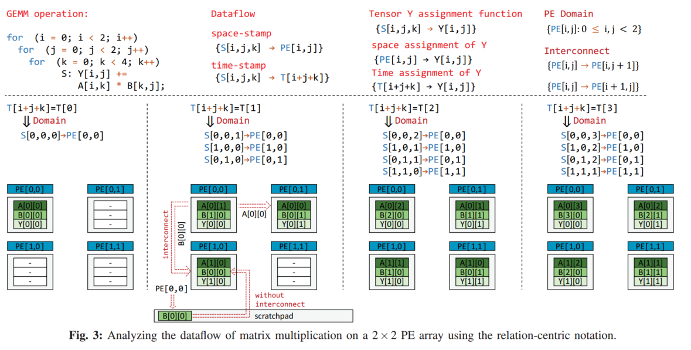

# TENET笔记

* TENET: A Framework for Modeling Tensor Dataflow Based on Relation-centric Notation
* 作者： 卢丽强，罗梓璋，梁云*
* 单位：北京大学
* ISCA‘21

## 1.Abstract

提出一种以关系为中心的表示法(relation-centric notation)来描述张量计算的硬件数据流。relation-centric notation指定了硬件数据流、PE互联和数据分配。通过复杂的仿射变换(基于多面体库isl、barvinok)，相比计算为中心和数据为中心的表示更具表现力，支持精确的数据复用、带宽、延迟以及能量估计。和最先进的数据为中心的表示相比，可以获得更复杂的数据流，使得CONV和GEMM计算kernel的延迟分别减少了37.4%和51.4%。

<!-- more -->

## 2.Introduction

空间架构定义为由PE阵列和memory hierarchy组成的架构，PE通过片上互联实现数据复用。

空间架构通过多种可选的数据流进行划分。张量计算描述为一个嵌套循环，一个硬件数据流被描述为

1. 循环实例被分配给PE阵列
2. PE上上循环实例的执行顺序


??? note

    ``` c++
    for(m=1;m<M;m++)
      for(n=1;n<N;n++)
        for(k=1;k<K;k++)
          S:C[m,n] += A[m,k]*B[k,n]
    ```

    对于以上一个矩阵乘法的三重循环，有三维迭代空间，一个循环实例对应于一个语句实例，即$S(m,n,k)$。定义PE的集合(space-stamp)$\{PE(x,y) | x\in[1,X], y \in [1,Y]\}$。

    1可以被描述为一个映射$S(m,n,k)\rightarrow PE(x,y)$  

    2可以描述为$S(m,n,k)|T(t) PE(x,y)\rightarrow S(m',n',k')|T(t+1) PE(x,y)$​
  

之前的以计算为中心和数据为中心的表示不能完整表示设计空间，如不能做仿射变换。以计算为中心的表示不能直接对数据传输和重用进行建模。数据中心的表示建模没有显示的描述张量元素的维度，计算的性能的指标不够准确。

提出关系中心的表示，形式化的定义了

* 循环实例和PE的关系
* 循环实例在PE上执行顺序
* PE以及相应被赋予的张量元素的关系
* PE间的互联关系

前两点描述了数据流，第三点描述了PE张量元素是什么时候被哪个PE访问，第四点描述张量元素是如何在PE间移动的。

## 3.Backround

### 3.1 Notation Basics


​

* 迭代域(Iteration Domain)

  * 一个具有一个语句S的嵌套循环，其迭代域$D_S$是包含所有循环实例的集合，每个循环实例可以表示为$S[\vec{n}]$，是$D_S$中的一个点。
  * 如对于一个一维卷积，其迭代域记为$D_S=\{S[i,j]:0\leq i<4,0\leq j<3\}$
* 访问函数(Access Function)

  * 给定一个循环实例，访问函数返回语句S访问的张量元素。使用一个关系(映射)来表张量$F$的访问函数。
  * $$
    \begin{equation}
    A_{S,F} = \{S[\vec{n}]\rightarrow F[\vec{f}]\}
    \end{equation}
    $$
  * $$
    \vec{f} = A_{S,F}\vec{n}
    $$
  * 对于Fig.1中的一维卷积，张量$Y$的访问函数是$\{S[i,j]\rightarrow Y[i]: 0\leq i <4, 0\leq j <3\}$，表示循环实例$S[i,j]$访问张量元素$Y[i]$

??? note

    可表示为如下形式
    $$
      \vec{f}=
      \begin{bmatrix}
      0 &1
      \end{bmatrix}
      \vec{n}
      $$

### 3.2 现有数据流表示的限制

​​

不支持偏斜的数据访问

## 4 关系记号

### 4.1 Dataflow Relation

给定语句$S$和迭代域$D_S$，以及相应的迭代向量$\vec{n}$，dataflow被定义为如下形式

$$
\begin{equation}
\Theta_{S,D}=\{S[\vec{n}]\rightarrow(PE[\vec{p}]\; |\;T[\vec{t}])\}, \quad S[\vec{n}] \in D_S 
\end{equation}
$$

space-stamp就是PE的坐标，time-stamp就是循环实例在PE上执行的时间。所以$\Theta_{S,D}$描述了循环实例$S[\vec{n}]$如何被付给了一个spacetime-stamp(即space-stamp为$PE[\vec{p}]$，time-stamp是$T[\vec{t}]$)，执行顺序是由两个时间戳的字典序(lexicograohical order)决定的。$\vec{p}$是和PE阵列的维度相同的多维向量。$\vec{t}$可以是多维向量，因为PE阵列的大小可以小于整个迭代域，即使用有多个维度的索引，如卷积网络，将OX和OY进行空间展开，使用$(b,g,k,c)$来索引时间。

脉动阵列可以表示为

$$
\begin{equation}
\Theta_{S,D}=\{ S[i,j,k] \rightarrow (PE[i,j]\; | \; T[i+j+k])\}
\end{equation}
$$

可以通过整数线性规划来得到相应的数据流，即在时刻t时，哪些PE执行哪个循环实例。对于时间戳$T[1]$，可以得到以下的方程和约束，以及相应的要被执行的循环实例

$$
\begin{gather*}
i+j+k=1\\
constraint:0\leq i,j \lt 2, 0\leq k \lt 4 \\
loop\; instance:[i,j,k]=[0,0,1],[1,0,0],[0,1,0]
\end{gather*}
$$

相对data-centric和compute-centric的记法，具有能够表达更大设计空间。对于一个2维PE阵列，在data-centric的记号中，令$size$和$offset$都为1($size$决定了这个维度空间展开，其子阵列的大小，$offset$决定子阵列分配的范围，如果子阵列Sub[0]分配了[0,1]，Sub[1]分配了[2,3],则offset为2，如果Sub[0]分配了[0,2]，Sub[1]分配了[1,3],offset为1)，其设计空间大小为$n!\binom{n}{2}$（$n!$是维度顺序，$\binom{n}{2}$是选择两个维度进行空间展开）；而对于TENET的设计空间大小为$O(2^{n^{2}})$（将一种仿射变换看作一种数据流，仿射变换是一个n*n的矩阵，每个元素可以取0和1，去除一些不符合需求的情况,因此是$O(2^{n^2})$)

仿射变换的形式如下，其中$\Theta_{S,D}$是仿射变换矩阵，对应于数据流映射$\Theta_{S,D}$​

$$
\vec{ST}=\begin{bmatrix}
 \vec{p}\\
\vec{t}
\end{bmatrix}
=\Theta_{S,D}\vec{n}
$$

对于Eq.3的数据流，$T_{dataflow}$形式如下

$$
\Theta_{S,D}=
\begin{bmatrix}
  1 &  & \\
    &1 & \\
  1 &1 &1
\end{bmatrix}
$$

$$
\vec{p}=
\begin{bmatrix}
  1 &0  &0 \\
  0  &1 &0 
\end{bmatrix}
\vec{n}
,\quad 
\vec{t}=
\begin{bmatrix}
  1 &1  &1 
\end{bmatrix}
\vec{n}
$$

对于维度大小大于PE阵列尺寸的，加入求余和除法记号来支持(拟仿射变换，quasi-affine transformation)

$$
\Theta_{S,D}=\{ S[i,j,k] \rightarrow (PE[i\ mod\ 8,\ j \ mod \ 8]\; | \; T[i/8,j/8,(i\ mod\ 8+\ j \ mod \ 8+k)])\}
$$

### 4.2 Data Assignment Relation

data assignment relation是指特定PE在特定时刻访问的元素，即spacetime-stamp到元素的映射，由访问函数是循环实例到元素的映射，数据流是循环实例到spacetime-stamp的映射，所以可以由数据流和访问函数得到data assignment relation

$$
\begin{aligned}
\vec{ST}=\Theta_{S,D}\vec{n} 
\quad
\Longrightarrow
\quad
 \vec{n} = \Theta_{S,D}^{-1}\vec{ST}\\
\vec{f}=A_{S,F}\vec{n}=A_{S,F}\Theta_{S,D}^{-1}\vec{ST}=A_{D,F}\vec{ST}
\end{aligned}
$$

$$
\begin{equation}
A_{D,F} = \Theta_{S,D}^{-1}\cdot A_{S,F}=\{(PE[\vec{p}]\ |\ T[\vec{t}])\rightarrow F[\vec{f}]\}
\end{equation}
$$


对下图所示的数据流，tensor Y的数据赋予可以表示为
$$
A_{D,F_Y}=\{(PE[i,j]\ | \ T[i+j+k])\rightarrow Y[i,j]\}
$$

$$
A_{S,F}\Theta_{S,D}^{-1}=
\begin{pmatrix}
  1 &0  &0 \\
  0  &1 &0 
\end{pmatrix}
\begin{pmatrix}
  1 &  & \\
    &1 & \\
  1 &1 &1
\end{pmatrix}^{-1}=
\begin{pmatrix}
  1 &0  &0 \\
  0  &1 &0 
\end{pmatrix}
\begin{pmatrix}
  1 &  & \\
    &1 & \\
  -1 &-1 &1
\end{pmatrix}=
\begin{pmatrix}
  1 &0  &0 \\
  0  &1 &0 
\end{pmatrix}
$$

​​

‍

### 4.3 PE interconnection

对于一个PE阵列，PE互联是一个集合，集合内的每个元素是描述一个PE到另外一个PE的映射(PE作为顶点，互联就是边)

$$
\begin{equation}
I_{PE_1,PE_2}=\{PE[\vec{p_1}]\rightarrow PE[\vec{p_2}]\}\ :c_1,...,c_k
\end{equation}
$$

其中$c_1,...,c_k$是用于指定拓扑的条件。对于Fig. 3的2D脉动阵列，PE能够复用邻近PE的输入数据。TENET建模了三种互联

​​

### 4.4 Spacetime-stamp Map Relation

通过data assignment和interconnection relation，基于被访问元素和元素的移动，可以关联不同的spacetime-stamp

给定一个dataflow，spacetime-map是一个映射的集合，元素将一个spacetime-stamp映射到另外一个spacetime-stamp，即spacetime-stamp间的执行顺序。如果以spacetime-stamp为顶点建立一个图，spacetime-map就是边。

$$
M_{D,D'}=\{(PE[\vec{p_1}]\ |\ T[\vec{t_1}])\rightarrow (PE[\vec{p_1}]\ |\ T[\vec{t_1}])\}
$$

通过使用data assignment relation识别spacetime-stamp所用的数据，可以找到数据的时空复用。

假设$D$和$D'$的时间距离小于等于1，$D$和$D'$所指定的PE是互联的，对于Fig.3可以给出3个map

​​

map 1结合$A_{D,F_Y}$可以得到以下式子，从而得到Y[0,0]的时间复用，同理可以在map 2和3得到A和B的空间复用

​​

可以通过spacetime-stamp map结合data assignment relation得到数据的时间和空间复用

## 5 性能模型

通过relation来建模性能

### 5.1 data reuse and volume model

​​

使用$sum()$函数来计算容量volume，即计算集合的势。

* TotalVolume：通过整个spacetime-stamp计算总共被访问的元素数

  * ​​
  * ​​
  * Fig. 5(a)所示不同time-stamp访问的数据，包含了复用
* ReuseVolume：是多个spacetime-stamp中数据的复用数量

  * 对于Fig. 5(a),复用是相邻两个spacetime-stamp中重叠的部分的数量。
  * 由spacetime-map $M_{D,D'}$决定两个spacetime-stamp相邻，spacetime-stamp map被interconnection relation限制。
  * 即只有满足等式5的两个PE才能贡献复用（即访问了相同元素，但两个PE不相邻也是不满足复用。
  * 同时time-stamp也限制复用发生。对于脉动阵列，时间约束设置为1，即相邻两个time-stamp间会发生复用；对于多播，时间约束设置为0，即同一个time-stamp内发生约束。
  * ​脉动阵列

* UniqueVolume：被唯一访问的张量数据。Fig. 5(a)中UniqueVolume随时间逐渐扩张

  * 和数据复用类似，必须考虑相邻spacetime-stamp，复用只发生在相邻spacetime-stamp中，所以相邻spacetime-stamp中新出现的数据则可以认为是Unique。(从阵列级考虑）
  * 给出的是阵列和scratchpad之间传输所需的最小数据大小。
  * ​​
* ReuseFactor
* SpatialReuseVolume：在多个PE间复用数据的数量，包含广播和脉动阵列的前递(forwarding)
* TemporalReuseVolume：在相同PE里的多个时间戳之间的复用

### 5.2 延迟和带宽模型

假设buffer、network和算术单元流水线工作，并且使用了double buffer来隐藏延迟。所以整体延迟为通信和计算延迟的最大值。

* 基于UniqueVolume来评估PE阵列和scratchpad之间的数据搬运量。通信延迟为

$$
\begin{equation}
	\begin{aligned}
		Delay_{read}=\frac{UniqueVolume(Input)}{bandwidth}\\
		Delay_{write}=\frac{UniqueVolume(Output)}{bandwidth}
	\end{aligned}
\end{equation}
$$

此处的$bandwidth$是scratchpad的带宽。

* 计算延迟所有循环实例数除以平均的PE活跃数

$$
\begin{equation}
Delay_{compute}=\frac{sum(D_S)}{Util_{PE}\times PE\ size}
\end{equation}
$$

* 通过计算延迟，可以计算互联带宽和scratchpad带宽。互联带宽为：

$$
\begin{equation}
IBW=\frac{SpatialReuseVolume}{Delay_{compute}}
\end{equation}
$$

* SBW是PE阵列和scratchpad之间的数据传输带宽，使用归一化的(?)的UniqueVolume和计算延迟来估计

$$
\begin{equation}
SBW=\frac{UniqueVolume}{Delay_{compute}}
\end{equation}
$$

## 6 实验

### 6.1 实验设置

‍
